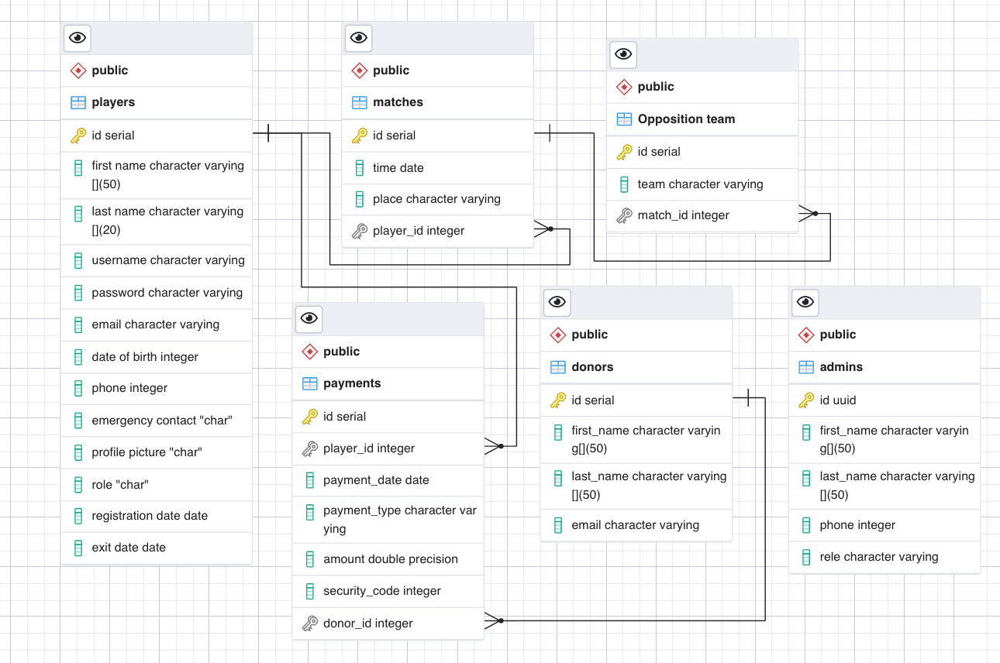

This Sports club's website is a fullstack restful web app. The major technologies used in this project will be NodeJS, Express, SQL, and PostgreSQL for creating an API, along with HTML5 and CSS for the frontend in combination with a frontend JavaScript framework called React. For the deployment of this project, website hosting site named Heroku will be used.  

Since it is a fullstack web application, the first and foremost focus will be on creating a database to store the admin and players' information. Then to access and manipulate the data stored in the database, an API will be designed and implemented with differnet endpoints. Once the backednd is accomplished with required endpoints, the frontend will be designed and implemented accordingly to display the information that a user is looking for. The front-end will provide a way for a user to make donations to the club or purchase an annual membership, there will be a need of an external api for payment processing. This api will be used in backend as well. As you can seee that the project requires a good amount of research and work in both ends, the programming emphasis will be distributed roughly equally between the front-end UI and the back-end API. 
The current focus of the project is to create a desktop website, and the strech goal is to extend it be accessed on mobile/smart phones as well.  

The goal of this project is quite simple. It is designed to provide an information about a cricket club named Aurora Everest Cricket club of Aurora, Colorado. The main purpose of this site is to provide information about the club as well as each player of the club. As an extended goal, the landing page of the site should provide an option for an admin to upload a small video clip of the club's progress such as a minute long video footage highlight of the match the club played, or any other functions that a club organized.  

The majority of the users visiting the app will be the players of the club, their family members, and the admin team of the club. It extends to the supporters and well wishers of the club as well. This also provides an opportunity for the people looking to join a cricket club in the city of Aurora. Other than the aforemetioned groups of people, the users could include the local sports enthusiasts, and others. Therefore, the website will be surfed by diverse array of people.  

Since the project involvs creating an own API as well as using an exteranl api, the type of data to be used in the project revolves around these two main requirements of the app. The data that will be stored in database includes a player's first name, last name, username, email, passsword, phone number, date of birth, the date of entry to the club, the date of termination from the club, emergency contact person, and a role in the club(eg batsman or wicket keeper). These data will be collected via a user's input when creating an account. For the payment processing, I need to do more research about the api that I am intended to use(that is stripe api). The strech goal includes defining the different categories of the admin such the President, Advisor, Coach, Captain, as well as Treasurer and providing them only needed access previlleges. 

The database shema consists of players, matches, payments, donors, and admins tables. It is shown in the sports-er-2.png file. 
 

 

This project deals with writing my own API. Therefore, it may encounter severals issues that I would have to be careful about. One major point that makes me aware is API going down due to internal server error. I need to do more research on this once the API is up and running. One testcase that I will try would be to turn off the postgres database and see how it behaves. This definitely should give some error that I will have to address in my code. There will be some sensitive information that I need to consider seriously. One of them would be the card information a user uses to make the payment. The other one would be the password of the user.
 

The major functionality that the app includes are proving data about each player of the club. It also has to provide information about the club. It includes the form for guests to provide feedback. Access previliges will be defined separately for players and admins. It also will provide features to make payment or donation to the club. The general features includes the aspects like about us page, players page, events page, contact page, and home page.
 

The userflow will be as follows: 
For the guest users, they can simple enter the app's URL on their favorite browser and view the general information about the club. For the players and admin users, they will have option to signup, login, and logout. After logging in they will have options to update their information, and view any relevant statistics. They can also make payments.
 
The functionalities such as providing details about how many games the club played so far, the number of the games won, lost, and tied would be one way of demonstrating more than a CRUD. Capturing the payment information and associating with the particular player also goes beyond the CRUD implementation. I am stil working on this topic.
